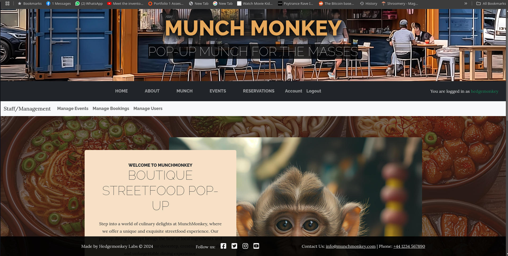
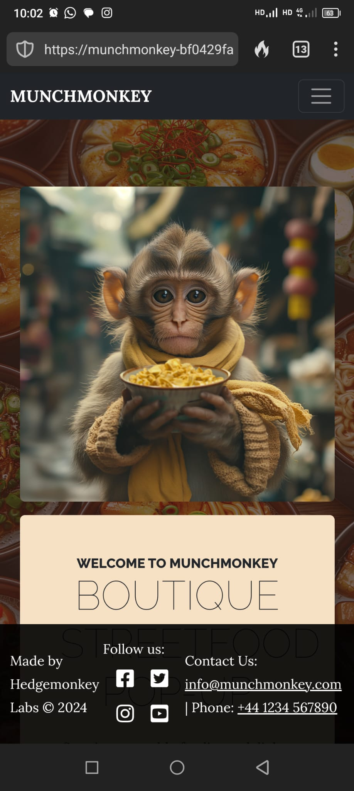
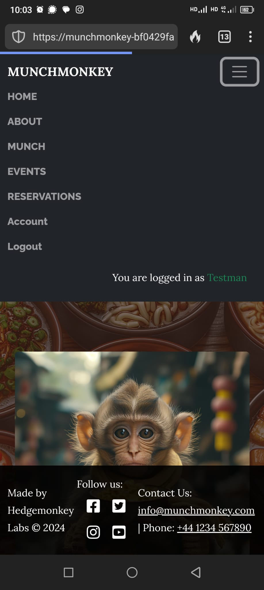

# MunchMonkey Pop-Up Restaurant

The MunchMonkey Pop-Up Restaurant site is intended to be used for marketing and promotional purposes for the pop-up restaurant **MunchMonkey**, providing users with an easy way to view the locations and times that the restaurant will be available, as well as the menu items that will be available. They will also be able to register an account in order to make reservations and provide reviews and feedback!

Live Site: [https://munchmonkey-bf0429fa9b54.herokuapp.com/](https://munchmonkey-bf0429fa9b54.herokuapp.com/)
Test credentials:

- Username: superuser
- Password: ReallySup3r


## Contents

<details>
<summary>Click here for Table of Contents</summary>

- [Project Goals](#project-goals)

- [Screenshots](#screenshots)

- [User Experience](#user-experience)<details><summary>Click to expand User Experience</summary>

  - [Epics](#epics)
  - [User Stories](#user-stories)
  - [Site Structure](#site-structure)<details><summary>Click to expand Site Structure</summary>

    - [Database Schema](#database-schema)
    - [Wireframes](#wireframes)
    </details>
  - [Design Choices](#design-choices)<details><summary>Click to expand Design Choices</summary>

    - [Typography](#typography)
    - [Colours](#colours)
    - [Components](#components)<details><summary>Click to expand Components</summary>

      - [Cards](#cards)
      - [Modals](#modals)
    </details>  
  </details>

- [Agile Project Management](#agile-project-management)

- [Features](#features)

- [Testing](#testing)

- [Validations](#validations)

- [Deployment](#deployment)

- [Credits](#credits)

</details>

## Project Goals

This site is designed for a fictional Pop-Up Restraunt company called **MunchMonkey** to provide it with a way to take online reservations and allow potential patrons to view the times and locations that the restaurant will be availiable. There is also functionaity for the management to view reservation requests and confirm that the reservation has been made. The management will also be able to add/remove additional dates and locations that they may be available.

The customers will also be able to see the Menus that will be availiable at any given date. Upon requesting a reservation the contact details of the customer will be viewable by the management in case there is a need to contact them. Customrs will be able to cancel the reservation given enough notice and this change will be updated accordingly.

[Back to top](#contents)

## Screenshots

### Large Display:

|  |
|----------------------------------------------|

### Mobile Display:

|  |  |
|----------------|-----------------|

[Back to top](#contents)


## User Experience

### Epics

The epics of this project are listed below. Each epic is accessible through GitHub Projects, where you can view the KanBan board for detailed progress and task management.

- **Initial Django Setup**: Setting up the Django framework, including project configuration, app creation, and initial settings.
- **User Access**: Implementing user authentication and authorization, including registration, login, logout, and user profile management.
- **Templates, Navigation and Styles**: Designing and implementing the front-end templates, navigation structure, and styling using CSS and Bootstrap.
- **Implementing Tests**: Writing and running unit tests for models, views, and templates to ensure the application functions correctly.
- **Booking Management**: Developing the booking system, including event creation, reservation management, and administrative controls.

### User Stories

Below are some basic user stories for each epic. Additional user stories can be found on the GitHub KanBan board.

#### Initial Django Setup

- As a **developer**, I can **set up the Django project** so that **I have a structured framework to build the application**.
- As a **developer**, I can **create Django apps** so that **I can organize the project into manageable components**.

#### User Access

- As a **user**, I can **register an account** so that **I can make reservations and manage my bookings**.
- As a **user**, I can **log in and log out** so that **I can access my account securely**.
- As a **user**, I can **update my profile** so that **I can keep my contact information current**.

#### Templates, Navigation and Styles

- As a **user**, I can **navigate the site easily** so that **I can find the information I need quickly**.
- As a **user**, I can **view a visually appealing site** so that **I have a pleasant browsing experience**.
- As a **developer**, I can **use reusable templates** so that **I can maintain consistency across the site**.

#### Implementing Tests

- As a **developer**, I can **write unit tests for models** so that **I can ensure the data integrity of the application**.
- As a **developer**, I can **write unit tests for views** so that **I can verify the correct functionality of the application**.
- As a **developer**, I can **run tests automatically** so that **I can catch errors early in the development process**.

#### Booking Management

- As a **user**, I can **view available events** so that **I can choose an event to attend**.
- As a **user**, I can **make a reservation** so that **I can secure a spot at an event**.
- As a **manager**, I can **view reservation requests** so that **I can confirm or deny bookings**.
- As a **manager**, I can **add or remove event dates and locations** so that **I can manage the availability of the restaurant**.

[Back to top](#contents)

## Site Structure

### Overview

Below is an overview of the site structure for the MunchMonkey project. The site is designed to allow users to view event locations and times, and to make reservations. The site also includes functionality for management to view and confirm reservations, manage the users, and manage event dates and locations.

### Home

The home page provides an introduction to MunchMonkey and highlights upcoming events.

### About

The about page provides information about MunchMonkey.

### Munch

The munch page provides information about the menu items available at upcoming events.

### Events

The events page allows users to view event locations and times, and filter events by location and date.

### Reservations

The reservations page allows users to make reservations for upcoming events.

### Account

The account page allows users to view and manage their account details, including their reservations.

### Admin

The admin pages allow management to view and confirm reservations, manage the users, and manage event dates and locations.

### Additional Information

- **Home**: The landing page of the site, providing an introduction and highlighting upcoming events.
- **About**: Information about MunchMonkey.
- **Munch**: Details about the menu items available at upcoming events.
- **Events**: A list of upcoming events with filtering options.
- **Reservations**: A form for users to make reservations for events.
- **Account**: User account management, including viewing and managing reservations and reviews.
- **Admin**: Management menu for viewing and confirming reservations, managing users, and managing event dates and locations.

[Back to top](#contents)

## Database Schema

### Overview

This document provides an overview of the database models used in the project. The models are defined in the `custom_auth` and `booking` apps. The `custom_auth` app contains a custom user model, while the `booking` app contains models for events and bookings.

### CustomUser Model

The `CustomUser` model extends Django's `AbstractUser` to include additional fields and relationships.

```python
# FILE: custom_auth/models.py
from django.contrib.auth.models import AbstractUser, Group, Permission
from django.db import models

class CustomUser(AbstractUser):
    phone_number = models.CharField(max_length=15, blank=True, null=True)

    groups = models.ManyToManyField(
        Group,
        related_name='customuser_set',  # Add related_name to avoid conflict
        blank=True,
        help_text='The groups this user belongs to.',
        related_query_name='customuser',
    )
    user_permissions = models.ManyToManyField(
        Permission,
        related_name='customuser_set',  # Add related_name to avoid conflict
        blank=True,
        help_text='Specific permissions for this user.',
        related_query_name='customuser',
    )

    class Meta:
        verbose_name = 'User'
        verbose_name_plural = 'Users'
```

[Back to top](#contents)

#### Fields

- **phone_number**: A `CharField` to store the user's phone number. It is optional.
- **groups**: A many-to-many relationship with the `Group` model, with a custom `related_name` to avoid conflicts.
- **user_permissions**: A many-to-many relationship with the `Permission` model, with a custom `related_name` to avoid conflicts.

[Back to top](#contents)

### Event Model

The `Event` model represents an event at a specific location and time, with a certain number of tables available for booking.

```python
# FILE: booking/models.py
from django.db import models
from django.utils import timezone
from custom_auth.models import CustomUser  # Import CustomUser model
from datetime import timedelta, datetime

class Event(models.Model):
    location = models.CharField(max_length=255)
    address = models.CharField(max_length=255, blank=True, null=True)
    start = models.DateTimeField()
    stop = models.DateTimeField()
    info = models.TextField(blank=True, null=True)
    event_tables = models.IntegerField(default=0)  # Updated field

    def __str__(self):
        return f"{self.location} ({self.start} - {self.stop})"

    def calculate_available_slots(self):
        slots = []
        current_time = self.start
        while current_time <= self.stop:
            slots.append(current_time)
            current_time += timedelta(minutes=15)
        return slots

    def get_available_tables(self, slot):
        # Check for confirmed bookings that start 30 minutes before to 30 minutes after the slot
        overlapping_bookings = Booking.objects.filter(
            event=self,
            start_time__gte=slot - timedelta(minutes=30),
            start_time__lt=slot + timedelta(minutes=45),
            confirmed=True  # Only count confirmed bookings
        )
        tables_occupied = sum((booking.number_of_people + 3) // 4 for booking in overlapping_bookings)
        available_tables = self.event_tables - tables_occupied
        return available_tables
```

#### Fields

- **location**: A `CharField` to store the event location.
- **address**: A `CharField` to store the event address. It is optional.
- **start**: A `DateTimeField` to store the start time of the event.
- **stop**: A `DateTimeField` to store the end time of the event.
- **info**: A `TextField` to store additional information about the event. It is optional.
- **event_tables**: An `IntegerField` to store the number of tables available for the event.

#### Methods

- **__str__**: Returns a string representation of the event.
- **calculate_available_slots**: Calculates and returns a list of available time slots for the event.
- **get_available_tables**: Returns the number of available tables for a given time slot.

[Back to top](#contents)

### Booking Model

The `Booking` model represents a booking made by a user for a specific event.

```python
class Booking(models.Model):
    id = models.AutoField(primary_key=True)  # Primary ID Unique field
    user = models.ForeignKey(CustomUser, on_delete=models.CASCADE)  # Link to CustomUser model
    confirmed = models.BooleanField(default=False)  # Confirmed field of type Boolean
    canceled = models.BooleanField(default=False) # Canceled field of type Boolean
    comments_user = models.CharField(max_length=1024, blank=True, null=True)  # Comments from user
    comments_staff = models.CharField(max_length=1024, blank=True, null=True)  # Comments from staff
    event = models.ForeignKey(Event, on_delete=models.CASCADE)  # Link to Event model
    start_time = models.DateTimeField()  # Start time of the booking
    end_time = models.DateTimeField()  # End time of the booking
    number_of_people = models.IntegerField()  # Number of people for the booking

    @property
    def tables(self):
        return (self.number_of_people + 3) // 4

    def save(self, *args, **kwargs):
        # Ensure the start_time and end_time are naive
        if self.start_time.tzinfo is not None:
            self.start_time = self.start_time.replace(tzinfo=None)
        if self.end_time.tzinfo is not None:
            self.end_time = self.end_time.replace(tzinfo=None)

        # If the booking is being canceled, skip the slot availability check
        if self.canceled:
            super().save(*args, **kwargs)
            return {'status': 'success'}

        # Set the end time to 44 minutes after the start time
        self.end_time = self.start_time + timedelta(minutes=44)
        
        # Calculate the number of tables needed
        tables_needed = self.tables
        
        # Check if there are enough available tables
        available_slots = self.event.calculate_available_slots()
        for slot in available_slots:
            # Convert slot to naive datetime
            slot_naive = slot.replace(tzinfo=None)
            if slot_naive <= self.start_time < slot_naive + timedelta(minutes=45):
                # Check if the slot is available
                if self.event.get_available_tables(slot) < tables_needed:
                    return {'status': 'error', 'message': 'Not enough available tables for this booking.'}
        super().save(*args, **kwargs)
        return {'status': 'success'}

    def __str__(self):
        return f"Booking {self.id} for {self.event.location} by {self.user.username}"
```

[Back to top](#contents)

#### Fields

- **id**: An `AutoField` that serves as the primary key.
- **user**: A foreign key linking to the `CustomUser` model.
- **confirmed**: A `BooleanField` indicating whether the booking is confirmed.
- **canceled**: A `BooleanField` indicating whether the booking is canceled.
- **comments_user**: A `CharField` for user comments. It is optional.
- **comments_staff**: A `CharField` for staff comments. It is optional.
- **event**: A foreign key linking to the `Event` model.
- **start_time**: A `DateTimeField` for the start time of the booking.
- **end_time**: A `DateTimeField` for the end time of the booking.
- **number_of_people**: An `IntegerField` for the number of people in the booking.

#### Methods

- **tables**: A property that calculates the number of tables needed based on the number of people.
- **save**: Overrides the default save method to ensure the start and end times are naive and to check table availability.
- **__str__**: Returns a string representation of the booking.

[Back to top](#contents)

### Database Schema

```plaintext
+------------------+       +------------------+       +------------------+
| CustomUser       |       | Event            |       | Booking          |
+------------------+       +------------------+       +------------------+
| id (PK)          |<----->| id (PK)          |<----->| id (PK)          |
| username         |       | location         |       | user_id (FK)     |
| email            |       | address          |       | event_id (FK)    |
| phone_number     |       | start            |       | confirmed        |
| password         |       | stop             |       | canceled         |
| groups (M2M)     |       | info             |       | comments_user    |
| user_permissions |       | event_tables     |       | comments_staff   |
+------------------+       +------------------+       | start_time       |
                                                      | end_time         |
                                                      | number_of_people |
                                                      +------------------+
```

[Back to top](#contents)

## Design Choices

### Typography

The primary fonts used in this project are 'Roboto' and 'Raleway'. These fonts were chosen for their readability and modern appearance, which align with the overall aesthetic of the MunchMonkey brand.

- **Roboto**: Used for body text and general content to ensure readability.
- **Raleway**: Used for headings and navigation to provide a clean and stylish look.

### Colours

The color scheme for the MunchMonkey project was selected to create a warm and inviting atmosphere, reflecting the pop-up restaurant's brand identity. The primary colors used are:

- **Primary Color**: `rgba(230, 190, 86, 0.9)` - A warm golden color used for highlights and callouts.
- **Secondary Color**: `rgba(230, 167, 86, 0.5)` - A softer golden color used for borders and secondary elements.
- **Background Color**: `rgba(var(--bs-primary-rgba))` - A dynamic background color that adapts to the primary theme.
- **Text Color**: `rgba(255, 255, 255, 0.9)` - A near-white color used for text to ensure readability against the background.

### Components

#### Cards

Cards are used throughout the project to display content in a clean and organized manner. They are used for event listings, menu items, and user information. The card design includes a header, body, and footer, with consistent styling to maintain a cohesive look.

Example CSS for Cards:

```css
.card {
  border: 1px solid rgba(230, 167, 86, 0.5);
  border-radius: 8px;
  box-shadow: 0 2px 4px rgba(0, 0, 0, 0.1);
  margin-bottom: 20px;
}

.card-header {
  background-color: rgba(230, 190, 86, 0.9);
  color: rgba(255, 255, 255, 0.9);
  padding: 10px;
  font-family: "Raleway", sans-serif;
}

.card-body {
  padding: 15px;
  font-family: "Roboto", sans-serif;
}
```

#### Modals

Modals are used to display additional information and forms without navigating away from the current page. They are used for reservation forms, user login and registration, and detailed views of events and menu items. The modals are designed to be responsive and accessible, providing a smooth user experience.

Example CSS for Modals:

```css
.modal-content {
  border-radius: 8px;
  box-shadow: 0 2px 10px rgba(0, 0, 0, 0.2);
}

.modal-header {
  background-color: rgba(230, 190, 86, 0.9);
  color: rgba(255, 255, 255, 0.9);
  font-family: "Raleway", sans-serif;
}

.modal-body {
  padding: 20px;
  font-family: "Roboto", sans-serif;
}
```

### Example CSS

Here are some example CSS rules that demonstrate the use of these fonts and colors:

```css
/* Callout Styles */
.callout-primary {
  background-color: rgba(var(--bs-primary-rgba));
  color: rgba(255, 255, 255, 0.9);
  border-color: rgba(230, 167, 86, 0.5);
}

/* Main content */
.main-content {
  min-height: calc(100vh - 200px);
}

/* Change Nav Stylings */
nav ul li a {
  font-family: "Raleway", sans-serif !important;
  display: block !important;
  font-weight: 800 !important;
}
```

These design choices help create a cohesive and visually appealing user experience, enhancing the overall look and feel of the MunchMonkey website.

[Back to top](#contents)

## Agile Project Management

### Overview

This project was developed using Agile methodologies to ensure a flexible and iterative approach to development. The Agile practices helped in managing the project efficiently, accommodating changes, and delivering a high-quality product.

### MoSCoW Prioritization

The MoSCoW method was used to prioritize tasks and features based on their importance and impact. The tasks were categorized into four groups:

- **Must Have**: Essential features and tasks that are critical for the project's success.
- **Should Have**: Important features and tasks that add significant value but are not critical.
- **Could Have**: Desirable features and tasks that enhance the project but are not essential.
- **Won't Have**: Features and tasks that are not included in the current scope but may be considered for future development.

### GitHub KanBan Board

A GitHub KanBan board was used to manage the project's tasks and track progress. The board was divided into columns representing different stages of development:

- **Epics**: High-level features and goals that are broken down into smaller tasks.
- **To Do**: Tasks that are ready to be worked on in the current iteration.
- **In Progress**: Tasks that are currently being worked on.
- **Final Stages**: Tasks that have been completed and are undergoing final checks and reviews.
- **Done**: Tasks that have been reviewed and approved.

By using this structure, the project was able to maintain clear visibility into the status of each task and ensure that work was progressing smoothly through each stage of development.


### Benefits of Agile Practices

Using Agile practices, including MoSCoW prioritization and the GitHub KanBan board, provided several benefits:

- **Flexibility**: Allowed for changes and adjustments to be made throughout the development process.
- **Transparency**: Provided clear visibility into the project's progress and status.
- **Collaboration**: Facilitated communication and collaboration among team members.
- **Focus**: Helped prioritize tasks and focus on delivering the most important features first.
- **Continuous Improvement**: Enabled iterative development and continuous improvement of the project.

By following Agile methodologies, the project was able to adapt to changes, manage tasks efficiently, and deliver a high-quality product.

[Back to top](#contents)

## Testing

### Overview

The testing suite for this project includes unit tests for the `Event` and `Booking` models. These tests ensure that the models behave as expected and that their methods return the correct results. The tests are written using Django's built-in testing framework.

### EventModelTests

The `EventModelTests` class contains tests for the `Event` model. This model represents an event at a specific location and time, with a certain number of tables available for booking.

1. **test_event_creation**: 
   - **Purpose**: Verifies that an `Event` instance is created with the correct attributes.
   - **Details**: This test checks that the `location`, `address`, `info`, and `event_tables` fields are correctly set when an `Event` instance is created.

2. **test_event_str**: 
   - **Purpose**: Checks the string representation of the `Event` instance.
   - **Details**: This test ensures that the `__str__` method of the `Event` model returns a string in the format "Location (start - stop)".

3. **test_event_calculate_available_slots**: 
   - **Purpose**: Ensures that the `calculate_available_slots` method returns a non-empty list of slots.
   - **Details**: This test verifies that the method correctly calculates and returns a list of available time slots for the event.

4. **test_event_get_available_tables**: 
   - **Purpose**: Verifies that the `get_available_tables` method returns the correct number of available tables.
   - **Details**: This test checks that the method correctly calculates the number of available tables for a given time slot, taking into account any overlapping bookings.

[Back to top](#contents)

### BookingModelTests

The `BookingModelTests` class contains tests for the `Booking` model. This model represents a booking made by a user for a specific event.

1. **test_booking_creation**: 
   - **Purpose**: Verifies that a `Booking` instance is created with the correct attributes.
   - **Details**: This test checks that the `user`, `event`, `number_of_people`, and `confirmed` fields are correctly set when a `Booking` instance is created.

2. **test_booking_str**: 
   - **Purpose**: Checks the string representation of the `Booking` instance.
   - **Details**: This test ensures that the `__str__` method of the `Booking` model returns a string in the format "Booking {id} for {event.location} by {user.username}".

3. **test_booking_tables**: 
   - **Purpose**: Ensures that the `tables` property returns the correct number of tables needed for the booking.
   - **Details**: This test verifies that the `tables` property correctly calculates the number of tables needed based on the number of people in the booking.

4. **test_booking_save**: 
   - **Purpose**: Verifies that the `save` method correctly sets the `end_time` attribute.
   - **Details**: This test checks that the `save` method sets the `end_time` to 44 minutes after the `start_time` and correctly handles the availability of tables.

[Back to top](#contents)

### Manual Testing

Extensive manual testing has been carried out throughout the development of this project. Multiple people across different devices were involved in testing the application, reporting issues, and providing feedback. This collaborative approach helped identify and resolve various bugs and usability issues.

#### Devices Used for Testing

- Desktop (Windows, macOS, Linux)
- Tablets (iOS, Android)
- Smartphones (iOS, Android)

#### Common Bugs and Solutions

1. **Responsive Design Issues**:
   - **Problem**: Some elements were not displaying correctly on smaller screens.
   - **Solution**: Implemented responsive design techniques using CSS media queries to ensure that the layout adapts to different screen sizes.

2. **Form Validation Errors**:
   - **Problem**: Users were able to submit forms with invalid data.
   - **Solution**: Added client-side and server-side validation to ensure that all required fields are filled out correctly before submission.

3. **Navigation Bar Overlapping Content**:
   - **Problem**: The navigation bar was overlapping with the main content on certain screen sizes.
   - **Solution**: Adjusted the CSS to ensure that the navigation bar is properly positioned and does not overlap with the content.

4. **Cross-Browser Compatibility**:
   - **Problem**: Certain features were not working correctly in all browsers.
   - **Solution**: Tested the application in multiple browsers and made necessary adjustments to ensure compatibility across all major browsers.

By conducting extensive manual testing and addressing these common issues, the project was able to deliver a robust and user-friendly application.

[Back to top](#contents)

## Validations

All code in this project has been passed through validators to ensure it meets ES6 standards and adheres to best practices for HTML and CSS.

### Validation Tools Used

- **ESLint**: Used to analyze the code for potential errors and enforce coding standards. The ESLint configuration is set to follow ES6 standards and best practices.
- **JSHint**: Used to detect errors and potential problems in the JavaScript code. Configured to support ES6 syntax and features.
- **Prettier**: Used to format the code consistently, ensuring readability and adherence to style guidelines.
- **W3C Validator**: Used to validate HTML and CSS code to ensure it meets web standards.
- **Pylint**: Used to analyze the Python code for potential errors and enforce coding standards. Configured to follow PEP 8 guidelines.

### Validation Process

1. **ESLint**: The code was run through ESLint with the following configuration:
```json
    {
        "env": {
            "browser": true,
            "es6": true
        },
        "extends": "eslint:recommended",
        "parserOptions": {
            "ecmaVersion": 2015,
            "sourceType": "module"
        },
        "rules": {
            "indent": ["error", 4],
            "linebreak-style": ["error", "unix"],
            "quotes": ["error", "single"],
            "semi": ["error", "always"]
        }
    }
```

2. **JSHint**: The code was validated using JSHint with the following configuration:
```json
    {
        "esversion": 6,
        "browser": true,
        "devel": true
    }
```

3. **Prettier**: The code was formatted using Prettier with the following configuration:
```json
    {
        "printWidth": 100,
        "tabWidth": 4,
        "useTabs": false,
        "semi": true,
        "singleQuote": true,
        "trailingComma": "es5",
        "bracketSpacing": true,
        "arrowParens": "avoid"
    }
```

4. **W3C Validator**: The HTML and CSS code was validated using the W3C Validator to ensure it meets web standards. The validation process involved copying the code into the W3C Validator tool and checking for any errors or warnings.

5. **Pylint**: The Python code was run through Pylint with the following configuration:
```ini
    [MASTER]
    ignore=venv

    [MESSAGES CONTROL]
    disable=C0111,  # Missing docstring
            C0103,  # Variable name doesn't conform to snake_case
            R0903,  # Too few public methods

    [FORMAT]
    max-line-length=100,  # Line length should not exceed 100 characters
```

### Results

All code passed the validation checks with no errors, ensuring that it adheres to ES6 standards and best practices. This helps maintain high code quality and readability throughout the project.

[Back to top](#contents)

## Deployment

This project has been deployed to Heroku. Below are the instructions on how to clone or fork the GitHub repository and deploy the project to Heroku.

### Cloning the Repository

To clone the repository, follow these steps:

1. Open your terminal or command prompt.
2. Navigate to the directory where you want to clone the repository.
3. Run the following command:

    ```sh
    git clone https://github.com/hedgemonkey/munchmonkey.git
    ```

4. Navigate into the cloned repository:

    ```sh
    cd munchmonkey
    ```

### Forking the Repository

To fork the repository, follow these steps:

1. Go to the GitHub repository page: [https://github.com/hedgemonkey/munchmonkey](https://github.com/hedgemonkey/munchmonkey)
2. Click the "Fork" button in the top-right corner of the page.
3. Follow the prompts to create a fork of the repository in your own GitHub account.

### Deploying to Heroku

To deploy the project to Heroku, follow these steps:

1. Create a Heroku account if you don't already have one: [https://www.heroku.com/](https://www.heroku.com/)
2. Install the Heroku CLI: [https://devcenter.heroku.com/articles/heroku-cli](https://devcenter.heroku.com/articles/heroku-cli)
3. Log in to your Heroku account using the CLI:

    ```sh
    heroku login
    ```

4. Navigate to the project directory:

    ```sh
    cd munchmonkey
    ```

5. Create a new Heroku app:

    ```sh
    heroku create
    ```

6. Set up the Heroku remote repository:

    ```sh
    git remote add heroku https://git.heroku.com/your-heroku-app.git
    ```

7. Deploy the project to Heroku:

    ```sh
    git push heroku main
    ```

8. Set up the necessary environment variables in Heroku. You can do this through the Heroku dashboard or using the CLI:

    ```sh
    heroku config:set DEBUG=False
    heroku config:set SECRET_KEY=your-secret-key
    heroku config:set DATABASE_URL=your-database-url
    ```

9. Run database migrations on Heroku:

    ```sh
    heroku run python manage.py migrate
    ```

10. Create a superuser account for testing:

    ```sh
    heroku run python manage.py createsuperuser
    ```

### Accessing the Deployed Project

The project is deployed at the following URL: [https://munchmonkey-bf0429fa9b54.herokuapp.com/](https://munchmonkey-bf0429fa9b54.herokuapp.com/)

### Manager/Superuser Account for Testing

- **Username**: superuser
- **Password**: ReallySup3r

[Back to top](#contents)

## Credits

- Startbootstrap Business Casual Theme - [https://startbootstrap.com/theme/business-casual](https://startbootstrap.com/theme/business-casual)
- GitHub Copilot AI - [https://github.com/github/copilot-ai](https://github.com/github/copilot-ai) - Assisted me throught the project answering any questions I have had
- Gemini AI - [https://gemini.google.com/app](https://gemini.google.com/app) - for some Immage Generation
- Midjourney AI - [https://www.midjourney.com/home](https://www.midjourney.com/home) - For other image generation
- favicon.io - [https://favicon.io/](https://favicon.io/) - Free generation of FavIcon
- The Code Institute community, including fellow students and staff.
- My family, friends, and peers who have helped and supported me with suggestions and feedback during development.
[Back to top](#contents)